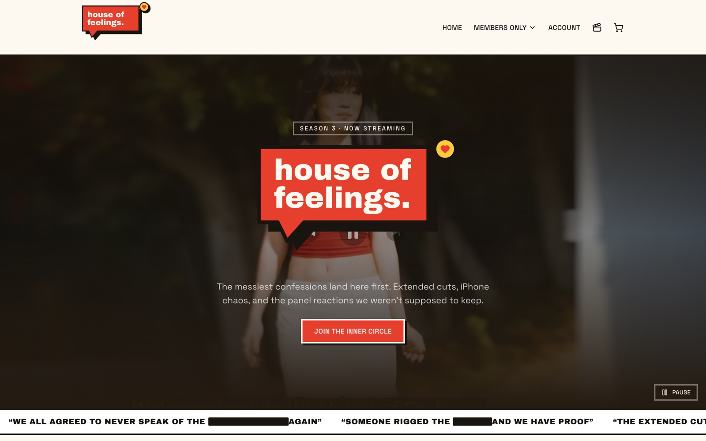
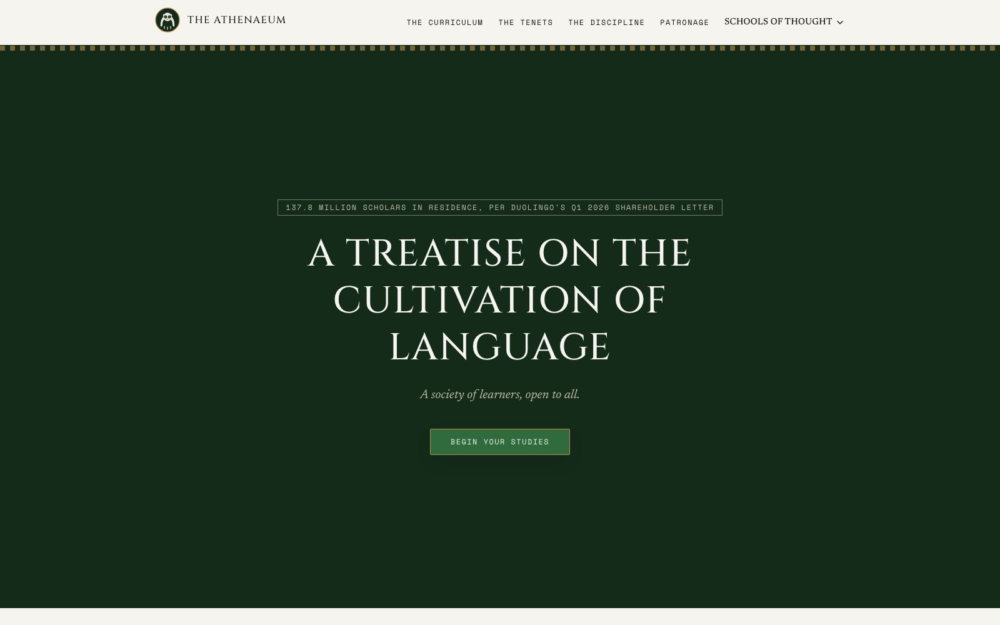

# Website Redesigns

Unsolicited redesigns of real companies' websites — picking sites that work fine as-is and asking what they'd look like with a distinct visual identity instead of a generic template feel. Each project keeps the original site's layout and functionality intent, and reworks the aesthetic: typography, color, motion, and overall personality.

Every project lives in its own folder below, with a live deploy and a screenshot.

## Projects

### [House of Feelings](./house-of-feelings)

Redesign of [houseoffeelings.show](https://houseoffeelings.show), a membership/streaming site for the reality show. Kept the original layout (hero, members-only feed, pricing tiers, video grid) and rebuilt the aesthetic around a "confessional corkboard" concept — a speech-bubble wordmark, redacted-quote ticker, and pinned sticky-note cards — in place of the source site's generic dark-template look.

**Live:** [house-of-feelings.vercel.app](https://house-of-feelings.vercel.app)
**Stack:** Next.js, TypeScript, Tailwind CSS, shadcn/ui

---

### [Duolingo — The Athenaeum](./duolingo)

Redesign of [duolingo.com](https://www.duolingo.com), the language-learning app. Kept the original homepage's bones (hero, course picker, value pillars, streak/gamification, pricing, testimonials, footer) and inverted the aesthetic: Duolingo's real public persona is unhinged, meme-heavy social marketing (Duo the owl's viral TikTok antics), so "The Athenaeum" plays it dead straight instead — Duo reframed as the literal Owl of Athena, a premium academic-society register in laurel green and bronze, Roman lapidary type, and manuscript-inspired shapes, with real Duolingo pricing/course data and a live translation exercise as the signature interactive piece.

**Live:** [duolingo-jet-ten.vercel.app](https://duolingo-jet-ten.vercel.app)
**Stack:** Next.js, TypeScript, Tailwind CSS, shadcn/ui, Motion

---

More redesigns coming soon.
